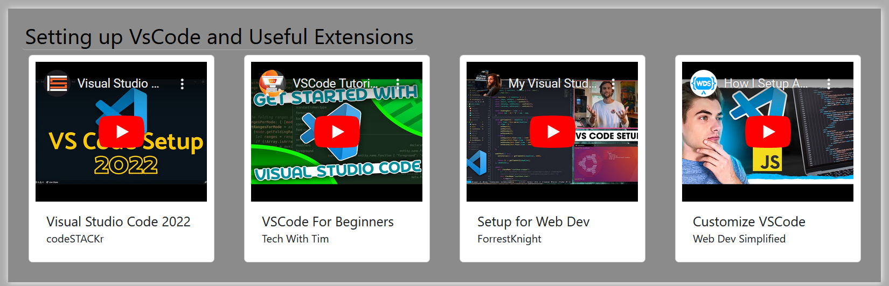

## TEAM NAME:

Team Vanilla

## Project Name (Options):

webMaestro.

\*\* Elevator Pitch:
We have come up with an ingenious
web product , which in itself, is a
solution to the problem that most
bootcamp students face, having to
rack their brains for relevant after
class study materials that takes into
account various learning styles such
as visual learning, etc, as well as
incorporates a note-taking section
while learning.
This is a Software App solution that
presents web links for students to
be able to reference learning resources
and tutorial videos from Youtube and
Reddit as recommended by the TAs
and organized based on subject. It
offers students flexibility and
proximity to their external learning
resources while taking away the
stress of searching endlessly for
materials on the web.

## Link to github repository

    https://github.com/AshivaA/web-maestro-app

## Link to deployed application
    https://ashivaa.github.io/web-maestro-app/  

## Table of Contents

[--> About web maestro app](#about-me)
[--> user story](#user-story)
[--> Acceptence criteria](#acceptance-criteria)
[--> Languages used](#5-languages-used)
[--> Browser Support](#6-browser-support)
[--> Screenshots](#7-screenshots-of-webpage)
[--> Installation](#8-installation)
[-->Contribution](#9-contribution)
[-->License](#10-license)
[-->Copyright](#copyright)

## 1. About the Web Maestro app

        The Project considers the fact that,
        as people are different, so do they also
        learn differently. Also, it brings
        learning resources to you rather than
        you going in an endless search for
        them.
        Upon logging into the App, the user
        is greeted with an interface to select
        their particular learning style, after
        which they are presented with
        resources after the manner of
        such selected style.

## USER STORY

        AS A UoB Front-End Bootcamp student,
        I WANT to find learning resources on
        covered content includingGit/GitHub, VsCode set up, HTML, CSS, JavaScript and APIs with ease,
        SO THAT I can devote more time to
        learning rather than searching.

## Acceptance Criteria:

        GIVEN that I am a UoB Bootcamp student

        WHEN I want to study after classes

        THEN I log into my account in my
        “web maestro” app (User authentication)

        THEN I chose my preferred learning
        style

        THEN I chose from a list of
        sequentially arranged topics

        WHEN a topic is selected

        THEN I am redirected to an external
        learning resource

        THEN I am also able to take notes
        while studying

        WHEN I want to search for any other topic

        THEN I can user search bar on the menu to search for topic on google.

## 4. Languages used

## 5. Browser support

## 6. Screenshots of webpage

## APIs used

        Youtube, Google custom search API

## 7. Installation

        No installation required

## 8. Contribution

        Aboje Oloche
        Emmanuel, Mohsin Khan Ajmal(HTML,CSS)

        Functionality(Javascript)
        Harpreet Kaur, Shiva Khande,Ricardo Oliveira

## 9. License

        MIT License

## copyright

    © 2023 WebMaestro, Inc
